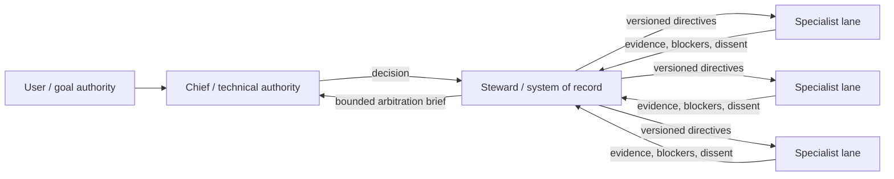

# AOI

**Agent Organization Infrastructure** — an experimental orgware layer for
governed, long-running multi-agent engineering work.

AOI treats an agent team as an organization with explicit authority, durable
state, bounded delegation, evidence gates, and configurable capability tiers.
It is not another chat router. It sits above an agent runtime and records what
the organization is allowed to do, what it decided, what changed, and what was
actually verified.

> Status: **v0.1.2 alpha**. The core lifecycle is tested, but AOI has not yet been
> proven better than a simpler single-agent or supervisor topology. Benchmark it
> on your own workload before relying on it.

## The operating model



- **Chief** is the only formal technical arbitrator.
- **Steward** validates versions, preserves evidence and dissent, and maintains
  the system of record. It does not decide technical questions.
- **Specialist lanes** execute bounded work and produce evidence.
- **User** retains goal, budget, preference, and irreversible-risk authority.

The organization is stable; execution topology is task-contingent. AOI records
single-lane, centralized-parallel, and controlled hybrid work instead of forcing
every request through every lane.

## What v0.1 contains

- Git-bound tasks, plans, claims, checkpoints, delivery records, and close gates
- exact file/tree/contract locks with conflict detection and SHA-bound baselines
- bounded delegation packets and external-job ownership, with task-local
  content-addressed snapshots for packet and verification artifacts
- lanes, dependencies, coordination requests, Chief decisions, directives, and
  independent verification before resolution
- `needs_user` escalation for goal, risk, budget, and preference decisions
- task-aware Capacity Planning recommendations for depth-two agents
- a bottom-up Improvement Pipeline with qualification, canary, rollback, and
  deprecation records for reusable skills
- deterministic state backup and integrity checks
- optional Codex lifecycle hooks that remain procedural guardrails, not a
  security boundary
- strict, model-agnostic project configuration in `aoi.toml`

AOI deliberately does **not** launch an LLM provider, choose a model brand,
install hooks silently, prevent non-cooperating processes from editing files, or
turn an acknowledgement into proof of implementation.

## Requirements

- Python 3.11+
- Git
- Linux/WSL or native Windows on a local filesystem

AOI binds each `.aoi/` state tree to one lock domain on first use: POSIX/WSL
uses `fcntl`, while native Windows uses `msvcrt` byte-range locking. Do not
alternate or concurrently write the same state tree from WSL and native
Windows; their locks do not interoperate. Native Windows support is limited to
ordinary local filesystems. UNC/network shares and case-sensitive NTFS are not
supported in v0.1.2.

## Install from source

```bash
git clone <your-fork-or-local-path>/aoi-orgware.git
cd aoi-orgware
python3 -m venv .venv
. .venv/bin/activate
python -m pip install .
aoi --version
```

On PowerShell, activate the virtual environment with
`.\.venv\Scripts\Activate.ps1`. On POSIX shells, use `. .venv/bin/activate`.

AOI is not published to PyPI yet. A wheel and source distribution can be built
with `python -m build`.

## Initialize a project

Run this in an existing Git repository:

```bash
cd /path/to/project
aoi init --project-name "My Project"
aoi status
aoi doctor
```

Initialization creates and tracks `aoi.toml`, adds `/.aoi/` to `.gitignore`,
and creates private runtime state under `.aoi/`. It does not install hooks.

### Bootstrap from project requirements

The repository includes the first-party [`aoi-bootstrap`](skills/aoi-bootstrap/)
Codex skill. It inspects an existing Git repository, combines that evidence with
the user's project requirements, and drafts a conservative organization profile.
Its fixed gate is:

```text
inspect -> draft -> validate -> preview -> explicit approval -> apply -> doctor
```

The skill does not initialize AOI, enable hooks, or overwrite an existing
profile before approval of the exact candidate SHA-256. Install or point Codex
at `skills/aoi-bootstrap`, then ask it to bootstrap AOI in the target repository.
The `aoi` CLI must already be installed in that environment.

Without the skill, the same validation/apply boundary is available directly:

```bash
# Run from the target Git repository root.
aoi config-check --file /path/to/candidate-aoi.toml --json
aoi init --config /path/to/candidate-aoi.toml \
  --expected-config-sha256 <approved-config-sha256> --json
aoi doctor --json
```

`config-check` is read-only and works even when an existing `aoi.toml` is
malformed. `init --config` requires the full approved SHA-256, copies the exact
validated bytes, refuses a different existing profile, and preflights the
selected state tree's lock domain, managed paths, and project `.gitignore`
before writing the configuration.

## Minimal governed task

```bash
# 1. Create a task and edit the generated plan.
aoi init-task \
  --task-id docs-fix \
  --title "Correct the setup guide" \
  --objective "Make the documented setup reproducible" \
  --owner root \
  --completion-boundary "Fresh install succeeds and the commands are documented"
$EDITOR .aoi/tasks/docs-fix/plan.md
aoi approve-plan --task docs-fix --note "Scope and verification are explicit"

# 2. Claim the exact write scope before mutation.
aoi claim \
  --task docs-fix \
  --token docs-fix-claim \
  --owner root \
  --kind documentation \
  --lock repo:file:docs/setup.md \
  --intent "Correct the setup guide" \
  --validation "Run the documented commands in a fresh environment" \
  --expires-at 2099-01-01T00:00:00+00:00

# 3. Work, verify, and record the evidence boundary.
aoi add-verification \
  --task docs-fix \
  --category documentation_check \
  --status pass \
  --evidence "Fresh environment completed every documented command" \
  --command "./scripts/test-quickstart.sh" \
  --boundary "The documented local installation and initialization path"

# 4. Account for delivery, release ownership, checkpoint, and close.
aoi set-delivery --task docs-fix --mode local-only \
  --detail "Changes remain in the current local worktree"
aoi release-claim --token docs-fix-claim --status done \
  --reason "Scoped edit and verification completed"
aoi checkpoint --task docs-fix --next-action "Close the task"
aoi close-task --task docs-fix --summary "Setup guide is reproducible"
```

For a one-to-three-file, low-risk edit, `aoi start-mini` creates the task, plan,
session binding, and exact-file claim atomically. It intentionally rejects tree
claims, high-risk paths, delegation, and external jobs.

## Configuration

`aoi.toml` defines the project name, private state directory, departments,
role-to-capability-tier map, evidence vocabulary, receipt schema, high-risk
paths, external lock namespace, and optional integrations. Tasks bind the exact
configuration SHA-256; changing governance while a task is active fails closed.

See [configuration](docs/configuration.md), [architecture](docs/architecture.md),
and the [operating policy](docs/POLICY.md).

## Run a small closed alpha

AOI includes a self-contained kit for 3–5 classmates to test onboarding and
feasibility before a larger evaluation:

```bash
aoi pilot-init --output ./aoi-pilot-kit --json
cd ./aoi-pilot-kit
```

Native Windows cannot prove POSIX-style private permissions through the Python
standard library. Review the destination ACL yourself, then acknowledge that
boundary explicitly when generating private pilot material:

```powershell
aoi pilot-init --output .\aoi-pilot-kit --allow-unverified-windows-acl --json
```

The kit contains a controlled A/C protocol (`single` versus `aoi`), Codex
instructions, assignment and run-record templates, a private feedback form, and
an intentionally broken onboarding sample. The pilot commands work outside an
AOI-initialized project:

```bash
aoi pilot-validate --record records/run-001.json --json
aoi pilot-summary \
  --record records/run-001.json \
  --record records/run-002.json \
  --output summary.json \
  --format json \
  --json
```

The validator fails closed on unknown fields, missing measurement provenance,
unregistered oracles, and common private-path/credential patterns. The summary
includes only records with coordinator-sharing and aggregate consent and never
emits participant IDs. Closed-alpha public reporting is aggregate-only.
Read the complete [closed-alpha guide](docs/PILOT.md) before collecting data.

## Evaluate AOI instead of trusting the diagram

Compare the same bounded task set under:

1. one strong agent;
2. a conventional supervisor plus specialists;
3. AOI's Chief/Steward/governed-lane topology.

Measure completion quality, human intervention, total tokens, high-capability
model share, rework, stale-baseline conflicts, decision latency, unresolved
directives, and regression recurrence. See [evaluation](docs/evaluation.md).

## Development

```bash
PYTHONDONTWRITEBYTECODE=1 PYTHONPATH=src \
  python3 -m unittest discover -s tests -v
```

Validate the bundled skill with Codex's `skill-creator` validator before a
release. The skill is included in the Git repository and source distribution;
installing the Python wheel does not silently install it into a user's Codex
skill directory.

The repository keeps the original sanitized import as an auditable first
commit. [PROVENANCE.md](PROVENANCE.md) and `IMPORT_MANIFEST.json` document that
history; neither file is included in release artifacts.

## License

MIT. See [LICENSE](LICENSE).
