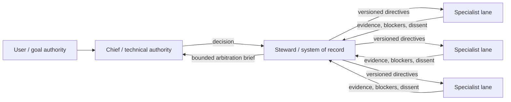

# AOI

**Agent Organization Infrastructure** — an experimental orgware layer for
governed, long-running multi-agent engineering work.

AOI treats an agent team as an organization with explicit authority, durable
state, bounded delegation, evidence gates, and configurable capability tiers.
It is not another chat router. It sits above an agent runtime and records what
the organization is allowed to do, what it decided, what changed, and what was
actually verified.

> Status: **v0.2.1 alpha**. The core lifecycle is tested, but AOI has not yet been
> proven better than a simpler single-agent or supervisor topology. Benchmark it
> on your own workload before relying on it.

## The operating model



- **Chief** is the only formal technical arbitrator.
- **Steward** validates versions, preserves evidence and dissent, and maintains
  the system of record. It does not decide technical questions.
- **Specialist lanes** execute bounded work and produce evidence.
- **User** retains goal, budget, preference, and irreversible-risk authority.

The organization is stable; execution topology is task-contingent. AOI records
single-lane, centralized-parallel, and controlled hybrid work instead of forcing
every request through every lane.

## What v0.2 contains

- Git-bound tasks, plans, claims, checkpoints, delivery records, and close gates
- exact file/tree/contract locks with conflict detection and SHA-bound baselines
- bounded delegation packets and external-job ownership (`--owner-packet-id`), with task-local
  content-addressed snapshots for packet and verification artifacts
- optional, immutable context-provider receipts with tri-state freshness,
  doctor/Steward health reporting, and navigation-only A/B summaries that can
  never qualify task closure
- packet dispatch provenance: short-lived Chief-issued arms, protocol-v6
  `SubagentStart` observation, pre-armed manual-unverified fallback, and
  durable unmanaged-start incidents
- task-global execution epochs: unselected work is implicit single, explicit
  single selections cannot run across work units, and parallel chains must share
  one centralized/hybrid selection; standalone external jobs occupy the same
  epoch and owned jobs remain inside their dispatched packet chain
- sequential Steward synthesis packets whose terminal result is required by a
  parallel/hybrid execution brief
- lanes, dependencies, coordination requests, Chief decisions, directives, and
  independent verification before resolution
- `needs_user` escalation for goal, risk, budget, and preference decisions
- task-aware Capacity Planning recommendations for depth-two agents
- a bottom-up Improvement Pipeline with qualification, canary, rollback, and
  deprecation records for reusable skills
- deterministic state backup and integrity checks
- one durable Chief lease per project with monotonic epochs, explicit takeover,
  and default fencing of lifecycle mutations
- repo-external Chief credentials: owner-only POSIX files or CurrentUser DPAPI
  on native Windows; plaintext tokens never enter shared AOI state or stdout
- deterministic checkpoint compaction at 16 KiB with a fail-closed 32 KiB hard
  ceiling; the separate critical-status view remains capped at 12 KiB
- optional Codex lifecycle hooks that consume one-time packet arms or record
  incidents; they remain post-start procedural guardrails, not a security boundary
- strict, model-agnostic project configuration in `aoi.toml`

AOI deliberately does **not** launch an LLM provider, choose a model brand,
install hooks silently, prevent non-cooperating processes from editing files, or
turn an acknowledgement or code graph into proof of implementation.

## Requirements

- Python 3.11+
- Git
- Linux, WSL on its native filesystem (or a mount with reliable POSIX metadata),
  or native Windows on an ordinary local filesystem

AOI binds each `.aoi/` state tree to one lock domain on first use: POSIX/WSL
uses `fcntl`, while native Windows uses `msvcrt` byte-range locking. Do not
alternate or concurrently write the same state tree from WSL and native
Windows; their locks do not interoperate. Native Windows support is limited to
ordinary local filesystems. UNC/network shares and case-sensitive NTFS are not
supported in the v0.2 line. Benign NTFS 8.3 aliases are canonicalized after
component-level reparse inspection; actual symlink/junction traversal is
rejected.

On WSL, metadata-less DrvFs mounts such as a default `/mnt/c` or `/mnt/d` may
report every file as broadly accessible. AOI intentionally fails closed instead
of claiming `0600` privacy there. Prefer the distribution's native filesystem
(for example `/home/<user>/project`) or enable DrvFs `metadata`, remount, and
verify the effective modes before initializing or migrating AOI state.

## Install from source

```bash
git clone <your-fork-or-local-path>/aoi-orgware.git
cd aoi-orgware
python3 -m venv .venv
. .venv/bin/activate
python -m pip install .
aoi --version
```

On PowerShell, activate the virtual environment with
`.\.venv\Scripts\Activate.ps1`. On POSIX shells, use `. .venv/bin/activate`.

AOI is not published to PyPI yet. A wheel and source distribution can be built
with `python -m build`.

## Initialize a project

Run this in an existing Git repository:

```bash
cd /path/to/project
aoi init --project-name "My Project"
aoi chief-acquire --session-id my-chief-session --json
aoi status
aoi doctor
```

Initialization creates and tracks `aoi.toml`, adds `/.aoi/` to `.gitignore`,
and creates private runtime state under `.aoi/`. It does not install hooks.

The first `aoi init` is the only unauthenticated lifecycle write. Copy the
`authority.epoch` and `credential_file` returned by `chief-acquire` into the
controlling session environment before running mutating commands:

```bash
export AOI_CHIEF_SESSION_ID=my-chief-session
export AOI_CHIEF_EPOCH=<epoch-from-acquire>
export AOI_CHIEF_CREDENTIAL_FILE=<absolute-path-from-acquire>
```

Use `aoi chief-renew` before a long turn and `aoi chief-release --reason
"handoff complete"` when ownership ends. An expired lease requires
`chief-takeover --expected-epoch ... --reason ...`; replacing a live lease also
requires `--force-live`. AOI never auto-steals a lease. A bounded five-second
clock-skew allowance is clamped to the last renewal; larger rollback fails.

### Bootstrap from project requirements

The repository includes the first-party [`aoi-bootstrap`](skills/aoi-bootstrap/)
Codex skill. It inspects an existing Git repository, combines that evidence with
the user's project requirements, and drafts a conservative organization profile.
Its fixed gate is:

```text
inspect -> draft -> validate -> preview -> explicit approval -> apply -> doctor
```

The skill does not initialize AOI, enable hooks, or overwrite an existing
profile before approval of the exact candidate SHA-256. Install or point Codex
at `skills/aoi-bootstrap`, then ask it to bootstrap AOI in the target repository.
The `aoi` CLI must already be installed in that environment.

Without the skill, the same validation/apply boundary is available directly:

```bash
# Run from the target Git repository root.
aoi config-check --file /path/to/candidate-aoi.toml --json
aoi init --config /path/to/candidate-aoi.toml \
  --expected-config-sha256 <approved-config-sha256> --json
aoi doctor --json
```

`config-check` is read-only and works even when an existing `aoi.toml` is
malformed. `init --config` requires the full approved SHA-256, copies the exact
validated bytes, refuses a different existing profile, and preflights the
selected state tree's lock domain, managed paths, and project `.gitignore`
before writing the configuration.

Re-running `aoi init` on an initialized project is a fenced mutation. Known
AOI-managed v0.1.3 policy bytes upgrade automatically; a custom policy requires
its exact reviewed digest through `--replace-policy-sha256`.

If first initialization stops after publishing `aoi.toml` but before the state
lock is initialized, `chief-acquire` can recover only the exact structural prefix: no
authority, lifecycle payload, managed resource, or unknown entry may exist. It
repairs the platform/lock, acquires the first Chief, and then requires an
authenticated rerun of `aoi init` to finish POLICY, templates, and INDEX.

## Minimal governed task

```bash
# 1. Create a task and edit the generated plan.
aoi init-task \
  --task-id docs-fix \
  --title "Correct the setup guide" \
  --objective "Make the documented setup reproducible" \
  --owner root \
  --completion-boundary "Fresh install succeeds and the commands are documented"
$EDITOR .aoi/tasks/docs-fix/plan.md
aoi approve-plan --task docs-fix --note "Scope and verification are explicit"

# 2. Claim the exact write scope before mutation.
aoi claim \
  --task docs-fix \
  --token docs-fix-claim \
  --owner root \
  --kind documentation \
  --lock repo:file:docs/setup.md \
  --intent "Correct the setup guide" \
  --validation "Run the documented commands in a fresh environment" \
  --expires-at 2099-01-01T00:00:00+00:00

# 3. Work, verify, and record the evidence boundary.
aoi add-verification \
  --task docs-fix \
  --category documentation_check \
  --status pass \
  --evidence "Fresh environment completed every documented command" \
  --command "./scripts/test-quickstart.sh" \
  --boundary "The documented local installation and initialization path"

# 4. Account for delivery, release ownership, checkpoint, and close.
aoi set-delivery --task docs-fix --mode local-only \
  --detail "Changes remain in the current local worktree"
aoi release-claim --token docs-fix-claim --status done \
  --reason "Scoped edit and verification completed"
aoi checkpoint --task docs-fix --next-action "Close the task"
aoi close-task --task docs-fix --summary "Setup guide is reproducible"
```

## Dispatch a bounded Codex sub-agent

Create the packet first. Immediately before the corresponding Codex spawn,
issue a permit that expires within 15 minutes:

```bash
aoi create-packet \
  --task <task-id> \
  --packet-id <packet-id> \
  --agent-role explorer \
  --model-tier standard \
  --objective "Inspect one bounded evidence question" \
  --scope "Read only the named source and report one conclusion" \
  --deliverable "Conclusion, exact evidence paths, risks, and next action" \
  --validation "Chief checks every cited path"

aoi packet-arm \
  --task <task-id> \
  --packet-id <packet-id> \
  --expected-agent-type explorer \
  --expires-at <timezone-aware-timestamp-within-15-minutes>

# Spawn exactly one matching Codex sub-agent now.
```

If the task-bound parent Codex session differs from the Chief credential's
session assertion, add `--parent-session-id <task-bound-session-id>`.

A trusted protocol-v6 `SubagentStart` hook consumes that arm and records the
actual agent id as `codex_subagent_start_observed`. If no unique arm exists, AOI
records an open incident and tells the already-created agent to stop without
material work. The hook observes the start; it does not prevent the spawn.

When hooks are unavailable, use the same already-issued arm and register the
fallback honestly:

```bash
aoi packet-update --task <task-id> --packet-id <packet-id> \
  --status dispatched --agent-id <actual-agent-id> \
  --manual-unverified-reason "Codex hook was not installed or trusted for this start"
```

For schema-v5 packets, this command succeeds only from `armed`. Direct
`ready -> dispatched` registration is rejected; a ready v4 packet has a
separately marked migration exception only when its immutable contract does not
carry the native-v5 marker and its task has pre-marker legacy provenance. A
native policy-v2 task cannot invoke that exception. Manual fallback also
revalidates arm expiry, Chief epoch, plan, packet, topology, lane/Steward, and
skill authority before it can consume the permit.

For parallel work, first select `centralized_parallel` or `hybrid` with distinct
specialist `--lane` values and `--steward-lane-id`. Unselected work is an
implicit `single`; an explicit `single` occupies the task-global execution
epoch even when another work unit has a different selection. Parallel modes
permit one active chain per specialist lane only inside the same selection.
Queued/running/unknown jobs obey the same epoch. Pass `--owner-packet-id` when a
job is launched by an already-dispatched depth-one mutation packet; its locks
must cover the job outputs (and an exact-command owner must bind the same
command), and that packet must stay active until the job is terminal. AOI
revalidates the physical owner contract plus canonical lock/command authority at
job creation, each transition to running, and doctor. Independent centralized
work does not require fake coordination records.

After all selected specialist packets are terminal, create one read-only packet
on the Steward lane with
`--steward-synthesis-for-selection-id <selection-id>`, arm and dispatch it, and
record its terminal result. Once a live/successful synthesis packet exists, AOI
freezes new specialist packets and jobs for that selection so the bound result
set cannot change underneath it. Then `execution-brief-record` must name that exact
result with `--steward-packet-id <packet-id>` and bind every terminal specialist
packet before selection supersession or task close.

### Optional codebase-memory context

Phase 1 can import a reviewed codebase-memory v0.9.0 receipt without launching
the provider, refreshing an index, or enabling a watcher:

```bash
aoi context-receipt-record \
  --task <task-id> --provider codebase-memory \
  --receipt-id <receipt-id> \
  --receipt /absolute/path/to/receipt.json \
  --receipt-sha256 <full-sha256> \
  --requirement optional \
  --freshness-profile codebase-memory-git-v1 \
  --session-id <bound-root-session> --json

aoi doctor --task <task-id> --json
```

Only the Chief-fenced import mutates AOI state. Specialist access remains
read-only graph query access, and Steward output is limited to receipt
integrity, provider health, freshness, dissent, and a brief. Graph searches and
navigation benchmarks are always `engineering_inference`, never compile,
simulation, numeric, synthesis, physical, signoff, or other close-qualifying
evidence. Optional stale/unverifiable receipts warn and fail open; a receipt
blocks only when the task explicitly records it as `required`.

The separate A/B protocol compares `rg_open` with
`codebase_memory_assisted` using externally captured, mutation-free run records:

```bash
aoi codebase-memory-benchmark-validate --record run.json --json
aoi codebase-memory-benchmark-record \
  --task <task-id> --benchmark-id <benchmark-id> \
  --receipt-id <receipt-id> \
  --record rg-open.json --record graph-assisted.json \
  --record-sha256 <rg-sha256> --record-sha256 <graph-sha256> \
  --session-id <bound-root-session> --json
```

See the [codebase-memory integration contract](docs/codebase-memory.md).

For a one-to-three-file, low-risk edit, `aoi start-mini` creates the task, plan,
session binding, and exact-file claim atomically. It intentionally rejects tree
claims, high-risk paths, delegation, and external jobs.

## Configuration

`aoi.toml` defines the project name, private state directory, departments,
role-to-capability-tier map, evidence vocabulary, external-job receipt schema,
high-risk paths, external lock namespace, and optional hooks. Task-local
context-provider receipts do not alter this strict configuration schema. Tasks bind the exact
configuration SHA-256; changing governance while a task is active fails closed.

See [configuration](docs/configuration.md), [architecture](docs/architecture.md),
the [v0.2 migration runbook](docs/v0.2-migration.md), and the
[operating policy](docs/POLICY.md).

## Run a small closed alpha

AOI includes a self-contained kit for 3–5 classmates to test onboarding and
feasibility before a larger evaluation:

```bash
aoi pilot-init --output ./aoi-pilot-kit --json
cd ./aoi-pilot-kit
```

Native Windows cannot prove POSIX-style private permissions through the Python
standard library. Review the destination ACL yourself, then acknowledge that
boundary explicitly when generating private pilot material:

```powershell
aoi pilot-init --output .\aoi-pilot-kit --allow-unverified-windows-acl --json
```

The kit contains a controlled A/C protocol (`single` versus `aoi`), Codex
instructions, assignment and run-record templates, a private feedback form, and
an intentionally broken onboarding sample. The pilot commands work outside an
AOI-initialized project:

```bash
aoi pilot-validate --record records/run-001.json --json
aoi pilot-summary \
  --record records/run-001.json \
  --record records/run-002.json \
  --output summary.json \
  --format json \
  --json
```

Inside an initialized AOI project, pilot writers require that project's Chief
lease. They refuse the project root, managed state, and a write set spanning
multiple AOI projects even with `--force`.

The validator fails closed on unknown fields, missing measurement provenance,
unregistered oracles, and common private-path/credential patterns. The summary
includes only records with coordinator-sharing and aggregate consent and never
emits participant IDs. Closed-alpha public reporting is aggregate-only.
Read the complete [closed-alpha guide](docs/PILOT.md) before collecting data.

## Evaluate AOI instead of trusting the diagram

Compare the same bounded task set under:

1. one strong agent;
2. a conventional supervisor plus specialists;
3. AOI's Chief/Steward/governed-lane topology.

Measure completion quality, human intervention, total tokens, high-capability
model share, rework, stale-baseline conflicts, decision latency, unresolved
directives, and regression recurrence. See [evaluation](docs/evaluation.md).

## Development

```bash
PYTHONDONTWRITEBYTECODE=1 PYTHONPATH=src \
  python3 -m unittest discover -s tests -v
```

Validate the bundled skill with Codex's `skill-creator` validator before a
release. The skill is included in the Git repository and source distribution;
installing the Python wheel does not silently install it into a user's Codex
skill directory.

The repository keeps the original sanitized import as an auditable first
commit. [PROVENANCE.md](PROVENANCE.md) and `IMPORT_MANIFEST.json` document that
history; neither file is included in release artifacts.

## License

MIT. See [LICENSE](LICENSE).
