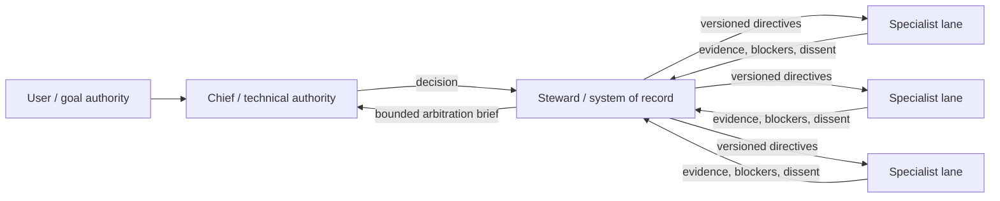

# AOI

**Agent Organization Infrastructure** — an experimental orgware layer for
governed, long-running multi-agent engineering work.

AOI treats an agent team as an organization with explicit authority, durable
state, bounded delegation, evidence gates, and configurable capability tiers.
It is not another chat router. It sits above an agent runtime and records what
the organization is allowed to do, what it decided, what changed, and what was
actually verified.

> Status: **v0.1 alpha**. The core lifecycle is tested, but AOI has not yet been
> proven better than a simpler single-agent or supervisor topology. Benchmark it
> on your own workload before relying on it.

## The operating model



- **Chief** is the only formal technical arbitrator.
- **Steward** validates versions, preserves evidence and dissent, and maintains
  the system of record. It does not decide technical questions.
- **Specialist lanes** execute bounded work and produce evidence.
- **User** retains goal, budget, preference, and irreversible-risk authority.

The organization is stable; execution topology is task-contingent. AOI records
single-lane, centralized-parallel, and controlled hybrid work instead of forcing
every request through every lane.

## What v0.1 contains

- Git-bound tasks, plans, claims, checkpoints, delivery records, and close gates
- exact file/tree/contract locks with conflict detection and SHA-bound baselines
- bounded delegation packets and external-job ownership
- lanes, dependencies, coordination requests, Chief decisions, directives, and
  independent verification before resolution
- `needs_user` escalation for goal, risk, budget, and preference decisions
- task-aware Capacity Planning recommendations for depth-two agents
- a bottom-up Improvement Pipeline with qualification, canary, rollback, and
  deprecation records for reusable skills
- deterministic state backup and integrity checks
- optional Codex lifecycle hooks that remain procedural guardrails, not a
  security boundary
- strict, model-agnostic project configuration in `aoi.toml`

AOI deliberately does **not** launch an LLM provider, choose a model brand,
install hooks silently, prevent non-cooperating processes from editing files, or
turn an acknowledgement into proof of implementation.

## Requirements

- Python 3.11+
- Git
- Linux, WSL, or another POSIX environment (`fcntl` locking is currently used)

Native Windows support is not part of v0.1. On Windows, run AOI inside WSL.

## Install from source

```bash
git clone <your-fork-or-local-path>/aoi-orgware.git
cd aoi-orgware
python3 -m venv .venv
. .venv/bin/activate
python -m pip install .
aoi --version
```

AOI is not published to PyPI yet. A wheel and source distribution can be built
with `python -m build`.

## Initialize a project

Run this in an existing Git repository with at least one commit:

```bash
cd /path/to/project
aoi init --project-name "My Project"
aoi status
aoi doctor
```

Initialization creates and tracks `aoi.toml`, adds `/.aoi/` to `.gitignore`,
and creates private runtime state under `.aoi/`. It does not install hooks.

## Minimal governed task

```bash
# 1. Create a task and edit the generated plan.
aoi init-task \
  --task-id docs-fix \
  --title "Correct the setup guide" \
  --objective "Make the documented setup reproducible" \
  --owner root \
  --completion-boundary "Fresh install succeeds and the commands are documented"
$EDITOR .aoi/tasks/docs-fix/plan.md
aoi approve-plan --task docs-fix --note "Scope and verification are explicit"

# 2. Claim the exact write scope before mutation.
aoi claim \
  --task docs-fix \
  --token docs-fix-claim \
  --owner root \
  --kind documentation \
  --lock repo:file:docs/setup.md \
  --intent "Correct the setup guide" \
  --validation "Run the documented commands in a fresh environment" \
  --expires-at 2099-01-01T00:00:00+00:00

# 3. Work, verify, and record the evidence boundary.
aoi add-verification \
  --task docs-fix \
  --category documentation_check \
  --status pass \
  --evidence "Fresh environment completed every documented command" \
  --command "./scripts/test-quickstart.sh" \
  --boundary "The documented local installation and initialization path"

# 4. Account for delivery, release ownership, checkpoint, and close.
aoi set-delivery --task docs-fix --mode local-only \
  --detail "Changes remain in the current local worktree"
aoi release-claim --token docs-fix-claim --status done \
  --reason "Scoped edit and verification completed"
aoi checkpoint --task docs-fix --next-action "Close the task"
aoi close-task --task docs-fix --summary "Setup guide is reproducible"
```

For a one-to-three-file, low-risk edit, `aoi start-mini` creates the task, plan,
session binding, and exact-file claim atomically. It intentionally rejects tree
claims, high-risk paths, delegation, and external jobs.

## Configuration

`aoi.toml` defines the project name, private state directory, departments,
role-to-capability-tier map, evidence vocabulary, receipt schema, high-risk
paths, external lock namespace, and optional integrations. Tasks bind the exact
configuration SHA-256; changing governance while a task is active fails closed.

See [configuration](docs/configuration.md), [architecture](docs/architecture.md),
and the [operating policy](docs/POLICY.md).

## Evaluate AOI instead of trusting the diagram

Compare the same bounded task set under:

1. one strong agent;
2. a conventional supervisor plus specialists;
3. AOI's Chief/Steward/governed-lane topology.

Measure completion quality, human intervention, total tokens, high-capability
model share, rework, stale-baseline conflicts, decision latency, unresolved
directives, and regression recurrence. See [evaluation](docs/evaluation.md).

## Development

```bash
PYTHONDONTWRITEBYTECODE=1 PYTHONPATH=src \
  python3 -m unittest discover -s tests -v
```

The repository keeps the original sanitized import as an auditable first
commit. [PROVENANCE.md](PROVENANCE.md) and `IMPORT_MANIFEST.json` document that
history; neither file is included in release artifacts.

## License

MIT. See [LICENSE](LICENSE).
